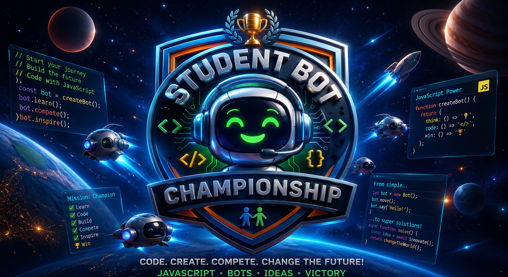

# Nim Game Tournament Platform



A multi-player tournament platform for testing game-playing bots in Nim-like games. Players register their bots, the server runs an automated championship with real-time live dashboard, and an admin panel for tournament control.

## Architecture Overview

### Server (`server.js`)
The **"Brain"** of the project. We've written it to be as readable as possible while remaining feature-rich.

**Key Technologies:**
- **Express** - HTTP web server
- **Socket.IO** - Real-time bidirectional communication with live dashboards
- **Node.js `vm` module** - Safely executes bot code in a sandboxed environment with timeout protection
- **Simple json storage** - Persistent tournament data across connected clients (not written in Educational mode)

**Key Concepts:**
- **`vm.Script`** - A "protective bubble" that runs student code. If there's an infinite loop (`while(true)`), the timeout setting stops execution before the server crashes.
- **`broadcast`** - Sends messages to all connected clients. This powers the live dashboard updates.
- **Delay mechanism** (`await new Promise(...)`) - Slows down game execution so players can actually see the emoji moves on the dashboard!

### Client Architecture (SPA)
A Single Page Application with one `index.html` that dynamically switches between **Registration View** and **Tournament Dashboard View** using JavaScript.

**Core Files:**
- **`public/index.html`** - Contains both registration form and live tournament arena
- **`public/style.css`** - Clean dark-mode aesthetic
- **`public/script.js`** - Handles Socket.IO connection, event processing, and real-time dashboard updates
- **`public/rules.html`** - Contains goal, rules of Game  and example of simple bot

### Admin Panel (`admin.html`, `admin.js`)
Secure interface for tournament administrators to:
- Start/pause/resume the tournament
- View registered players
- Inspect bot code
- Modify game configuration (piles, forbidden moves, time limits)
- Monitor tournament status

---

## Quick Start

### Prerequisites
Install dependencies:
```bash
npm install express socket.io
```

### Running the Server
```bash
node server.js
```
The server starts on `http://localhost:3000` and broadcasts the tournament start time to all connected clients.

### Accessing the Platform
- **Players**: `http://localhost:3000` - Registration and tournament dashboard
- **Admin**: `http://localhost:3000/adminAKME` - Tournament control panel (current password: `A..E`)

---

## Player Registration & Bot Submission

### Registration Flow
1. Player enters their **email** and **bot avatar picto** (e.g., 🐶,🐼,🐸)
2. Player writes or pastes their **bot code** following the required function signature
3. Click **Register** - the bot joins the tournament

### Bot Code Format
Players must implement a `play()` function that receives game state and returns a move:

```javascript
function play(piles, forbidden, context) {
                                              // TO DO 
                                              const target = piles.findIndex(p => p > 0); // find the first non-empty pile
                                              let NumberOfCoins;
                                               if(piles[target]==1) NumberOfCoins=1;
                                               else                 NumberOfCoins=2;
     
                                                if (forbidden.includes(NumberOfCoins)) NumberOfCoins=1;   // if for example 2 is forbidden we take 1 coin
     
                                                 return { pileIndex: target, count: NumberOfCoins }; 
                                         }
     //function play() INPUT: (piles, forbidden, context)
     // piles:     array of integers  (coins) representing the current state of the game
     // forbidden: array of forbidden moves
     // context:   { mode: CONFIG.mode, timeRemaining: player.timeBank } 
     //                    CONFIG.mode can be "NORMAL" or "GIVEAWAY" (see rules for details)
     //function play() OUTPUT: Return an object { pileIndex: target, count: NumberOfCoins };
     //For example { pileIndex: 0, count: 1 } represents Bot's  want to take 1 coin from pile with Index 0 
```

### Registration Features
- **Real-time player list** - All registered players appear on the admin panel
- **Email validation** - Prevents duplicate registrations
- **Microbots** - Built-in bots (🤖, 🤡, ☃️) automatically join every tournament
- **No persistence** - Registrations reset when the server restarts

---

## Tournament & Battle Display Features

### Automatic Tournament Start
The tournament starts automatically after a configurable delay (default: **15 minutes = 900 seconds**).

### Live Battle Display
When matches begin, all connected clients see:
- **Current players** - Which two bots are playing
- **Pile visualization** - Emoji coins showing the current game state
- **Move history** - Each player's emoji in the pile at the position of their move
- **Real-time updates** - All moves broadcast to all clients instantly

### Educational Mode (Grundy Numbers)
When `CONFIG.educational = true`, students see additional analysis:
- **Grundy value for each pile** - Format: `7(G= 3)` means pile of 7 with Grundy value 3
- **XOR-sum indicator** - 👍 (winning move) or 👎🏿 (losing move)
- **forbidding move indicator** - 🚷 indicate flowing position of forbidden moves 
- **Previous player tracking** -  shows where the previous player moved
- **Performance** - XOR calculations cached (10-20x faster than naive approach)

---

## Admin Panel Features

### Authentication
- Password-protected login (SHA256 hashing)
- Default password: `A..E`
- Session-based access

### Tournament Controls
- **Start Tournament** - Begin immediately (overrides scheduled start)
- **Pause** - Suspend all active matches
- **Resume** - Continue from pause
- **New Tournament** - Reset and start over
- **Countdown Timer** - Shows time until automatic start (HH:MM:SS format)

### Configuration Management
Modify game parameters in real-time:
- **Piles** - Initial pile configuration (e.g., `3,5,7` )
- **Forbidden Moves** - Disallowed move counts (e.g., `3,5`  or `0` if admin wants clear Nim tournir)
- **Base Time** - max Time per move in milliseconds (default: `10` ms)

Changes broadcast immediately to all clients.

### Monitoring
- **Player List** - All registered players with email and status
- **Bot Code Viewer** - Inspect any player's submitted code
- **Tournament Status** - Current state (Waiting, Running, Paused, Ended)
- **Real-time Updates** - All changes reflected as they happen

---

## Multi-Player Tournament Mechanics

### Match Generation
The server automatically generates all possible 1-vs-1 pairings:
- If N players are registered, total games = N × (N-1) / 2
- Example: 5 players = 10 games

### Round-Robin System
- Each player plays exactly once against each other player
- Matches execute sequentially with delays for visibility
- All clients watch the same match feed simultaneously

### Broadcasting
Real-time messages sent to all connected clients:
- Match start: `{ type: "CURRENT_FIGHT", ... }`
- Each move: `{ type: "MOVE", ... }`
- Tournament end: `{ type: "TOURNAMENT_ENDED", ... }`

---

## Troubleshooting

### Server Issues

#### Port is Already in Use
If you see `EADDRINUSE: address already in use :::3000`:

**Find the process:**
```bash
lsof -i :3000 -sTCP:LISTEN -Pn
```

**Kill the process:**
```bash
kill -9 <PID>
```

**Or use one-liner:**
```bash
fuser -k 3000/tcp
```

**Use a different port (temporary):**
```bash
PORT=3001 node server.js
```

#### Server Crashes or Unexpected Behavior
- **Check Node.js version**: `node --version` (tested with v14+)
- **Verify dependencies**: `npm install express socket.io`
- **Check console logs** - Look for error messages during startup
- **Restart server**: `node server.js` (clears in-memory database)

### Client Connection Issues

#### "Disconnected from Arena" or Connection Drops
The client automatically handles disconnections but may need manual reconnection:

**What happens:**
- Client displays "Disconnected from Arena" status
- Open a new browser tab and access `http://localhost:3000` again
- Re-register your bot (the server will add it to the queue for the next tournament)

**Prevention:**
- Keep browser tab visible (browser throttles background tabs)
- Ensure server is running: `ps aux | grep node`
- Check network connectivity

#### No Players Appearing After Registration
1. Verify Socket.IO connection - Check browser console (`F12` → Console tab)
2. Confirm server is running - Check terminal output
3. Check admin panel - Verify players appear there
4. Try refreshing the page (`Ctrl+R` or `Cmd+R`)

#### Bot Code Execution Timeout
If a bot takes too long to respond:
- Error message appears in dashboard
- Bot is skipped for that move
- Tournament continues with next match

**Fixes:**
- Optimize your bot code - Remove unnecessary loops
- Reduce computation complexity
- Use cached/pre-computed values instead of real-time calculation
- Check admin panel "Bot Code Viewer" for syntax errors

#### Browser Console Errors
- **"Cannot read property 'connected' of null"** - Socket.IO not initialized; refresh page
- **"Unexpected token in JSON"** - Server sent malformed message; restart server
- **"vm.Script timeout"** - Bot code is too slow; optimize and re-register

### Admin Panel Issues

#### Cannot Access Admin Panel
1. Verify URL is correct: `http://localhost:3000/adminAKME`
2. Check password - Default is `A..E`
3. Ensure server is running
4. Clear browser cache (`Ctrl+Shift+Delete`)

#### Configuration Changes Not Appearing on Dashboard
- Refresh the player page (`Ctrl+R`)
- Check browser console for errors
- Verify changes were saved (admin panel shows confirmation)

---

## Key Insights

**Bot Code Delivery:**
Bot code is transmitted as a simple **string** over the internet. On the server, `vm.Script` transforms it into executable code while maintaining isolation and safety.

**Database:**
The `players` object is the current database, stored in server memory. This means:
- ✅ Simple, no external database needed
- ⚠️ Data resets when server restarts
- ⚠️ Each server instance has its own separate tournament

**Communication:**
Socket.IO enables:
- Real-time game updates to all clients
- Instant dashboard refresh on each move
- Low-latency admin commands

---

## Educational Mode

For classroom settings, enable Educational Mode to help students learn game theory:

1. **Edit `server.js`**: Set `CONFIG.educational = true`
2. Restart server
3. Students now see:
   - Grundy numbers for game analysis
   - XOR-sum indicator (winning/losing positions)
   - Move history for each player
   - Optimal move recommendations (if configured)

---

## Version Information

**Current version:** 0.3.5

**Technology Stack:**
- Node.js (Express)
- Socket.IO v4.8+
- Vanilla JavaScript (no frameworks)
- Dark mode UI with emoji visualization
